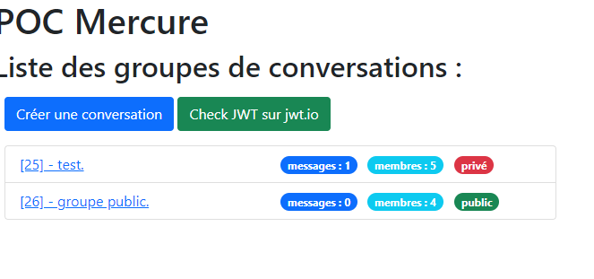
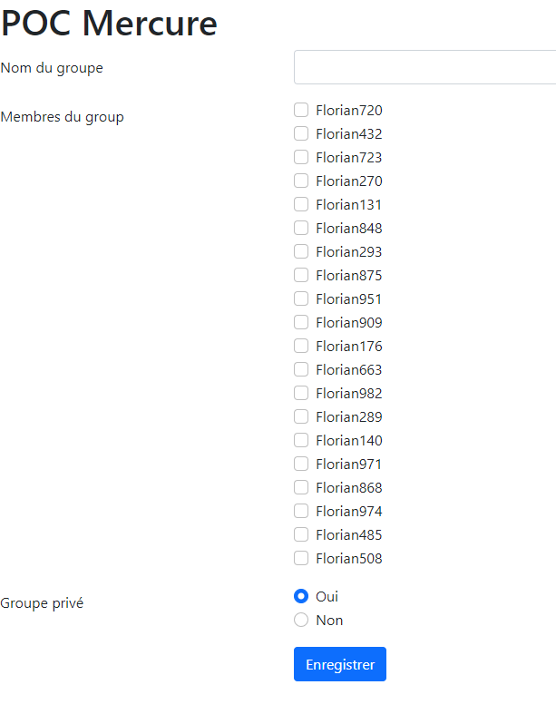
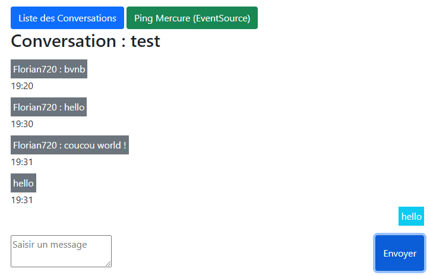

# Mise en place du POC Mercure Chat
###Liste des groupes

### Formulaire de création de groupe

### Formulaire d'envoi de messages

Le POC Mercure Chat consiste à mettre en place un chat avec différents groupes de conversation entre utilisateurs.
L'intéret de Mercure est de gérer les messages reçu en temps réel via SSE : [Server-sent event](https://en.wikipedia.org/wiki/Server-sent_events).

Informations  => [Mercure](https://mercure.rocks/)

##Installation :  Composer & BDD
1. Installer les bundles & dépendances :`composer install --dev & composer update -W`
2. Créer la BDD (DATABASE_URL doit être renseigné préalablement dans le fichier .env.local) : ``php bin/console doctrine:database:create``
3. Exécuter les migrations :``php bin/console d:mi:mi``
4. Éxécuter les fixtures : ``php bin/console doctrine:fixtures:load``

##Installation : Mercure

1. Télécharger Mercure pour votre environment => [ici](https://github.com/dunglas/mercure/releases)
2. Créer un fichier ``.env.local``
3. Exemple ``.env.local``

```
#BDD
DATABASE_URL="mysql://root@localhost:3307/poc_chat?serverVersion=mariadb-10.4.13"

###> symfony/mercure-bundle ###
# See https://symfony.com/doc/current/mercure.html#configuration
# The URL of the Mercure hub, used by the app to publish updates (can be a local URL)
MERCURE_URL=https://localhost:3000/.well-known/mercure
MERCURE_DEBUG=true
# The public URL of the Mercure hub, used by the browser to connect
MERCURE_PUBLIC_URL=http://localhost:3000/.well-known/mercure
# The secret used to sign the JWTs
MERCURE_JWT_KEY="YourJwtKey"
MERCURE_ALLOW_ANONYMOUS=1
# a list of origins allowed to publish (only applicable when using cookie-based auth)
MERCURE_PUBLISH_URL=http://localhost:3000/.well-known/mercure
MERCURE_PUBLISH_ALLOWED_ORIGINS=*
# If you use cookie or Authorization HTTP header
# MERCURE_PUBLISH_ALLOWED_ORIGINS="http://localhost:3000 http://localhost:8000"
# a space-separated list of allowed CORS origins, can be * for all
MERCURE_CORS_ALLOWED_ORIGINS=*
# If you use cookie or Authorization HTTP header
# MERCURE_CORS_ALLOWED_ORIGINS="http://localhost:3000 http://localhost:8000"
###< symfony/mercure-bundle ###
```
### Commande Windows  PowerShell

Pour lancer Mercure sur Windows :

`$env:ADDR=":3000";$env:SERVER_NAME=":3000";$env:JWT_KEY="YourJwtKey";$env:MERCURE_EXTRA_DIRECTIVES="cors_origins http://localhost:8000"; ./mercure run -config Caddyfile.dev`
### Fichier de conf CaddyFile

```
# Learn how to configure the Mercure.rocks Hub on https://mercure.rocks/docs/hub/config
{
    # Debug mode (disable it in production!)
    {$DEBUG:debug}
    # HTTP/3 support
    servers {
        protocol {
            experimental_http3
        }
    }
}

{$SERVER_NAME:localhost}

log

route {
    redir / /.well-known/mercure/ui/
    encode zstd gzip

    mercure {
        # Transport to use (default to Bolt)
        transport_url {$MERCURE_TRANSPORT_URL:bolt://mercure.db}
        # Publisher JWT key
        jwt_key {env.JWT_KEY}
        #public_url {env.MERCURE_PUBLIC_URL}
        # Publisher JWT key
        publisher_jwt {env.MERCURE_PUBLISHER_JWT_KEY} {env.MERCURE_PUBLISHER_JWT_ALG}
        # Subscriber JWT key
        subscriber_jwt {env.MERCURE_SUBSCRIBER_JWT_KEY} {env.MERCURE_SUBSCRIBER_JWT_ALG}
        #cors_origins {env.MERCURE_CORS_ALLOWED_ORIGINS}
        #publish_origins {env.MERCURE_PUBLISH_ALLOWED_ORIGINS}
        #demo
        #anonymous
        #subscriptions
        # Extra directives
        {$MERCURE_EXTRA_DIRECTIVES}
    }

    respond /healthz 200

    respond "Not Found" 404
}
```
## Twig
### Création d'une variable globale Twig MERCURE_PUBLISH_URL

Cette variable permet d'être utilisée lors de la communication avec le hub mercure, via javascript.
Elle retourne l'url du hub utilisé pour la communication.

Le fichier à modifier est situé dans : ```/config/packages/twig.yaml```
```
twig:
    globals:
        mercure_publish_url: '%env(MERCURE_PUBLISH_URL)%'
```
### Gestion en Javascript des réponses renvoyées par Mercure

Présent dans le fichier de template : ```templates/base.html.twig```
```
<script type='application/javascript'>
// Extract the hub URL from the Link header
const url   = new URL('{{ mercure_publish_url }}');
let pathUri = window.location.pathname.substring(1);

//Définir les topic a écouter : utilisation du template messages/{id} pour écouter plusieur sujet
url.searchParams.append('topic', '/messages/{id}');
//url.searchParams.append('topic', '/ping/{id}');

// listen to the HUB.
//MODE authorization, cookie or header
const eventSource = new EventSource(url, {withCredentials: true});
//MODE anonymous
//const eventSource = new EventSource(url);

eventSource.onmessage = (event) => {

    console.dir(event);
    console.debug(location.pathname);

    document.querySelector('h1').insertAdjacentHTML('afterend', `<div class="alert alert-success">Ping !</div> `);
    window.setTimeout( () => {
        const alert = document.querySelector('.alert');
        alert.parentNode.removeChild(alert);
    }, 2000)

}
</script>
```

## Tests
### Postman

Pour test la communication avec mercure voici une conf en JSON à imposter.

* Il faudra adapter le bearer token value symbolisé par le pattern ``[REPLACE_BY_YOUR_JWT]`` présent dans le fichier `test_postman.json`. 

* Importez dans Postman le fichier : `test_postman.json` présent à la racine du site.

Vous pouver générer un token JWT sur [jwt.io](jwt.io).

1. Exemple de PAYLOAD :
```
{
  "mercure": {
    "subscribe": ["*"],
    "publish": ["*"]
  }
}
```
    
2. VERIFY SIGNATURE : renseignez votre `MERCURE_JWT_KEY` (dispo dans .env & launcher_mercure.bat sous windows)